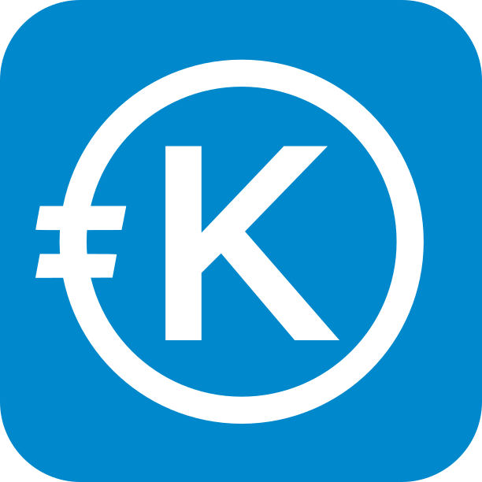

<!-- markdownlint-disable MD041 -->
<p align="center"></p>
<h1 align="center">
Kreditor
</h1>

<p align="center">
    <a href="https://github.com/mdeheij/kreditor/commits/" title="Last Commit"></a>
    <a href="https://github.com/mdeheij/kreditor/issues" title="Open Issues"></a>
    <a href="https://github.com/mdeheij/kreditor/blob/main/LICENSE" title="License"></a>
    <a href="https://kreditor.nl/" title="Kreditor website"></a>
</p>

<p align="center">
  <a href="#development">Development</a> •
  <a href="#openapi">OpenAPI</a> •
  <a href="./LICENSE">Licensing</a>
</p>

The goal of this project is to develop a flexible expense management and splitting application. This repository currently contains an API server built using Spring (REST) and Java.

**This project is under active development. Current API specification is very likely to change.**

## Development

### Prerequisites
- Java
- Maven

After you've checked out this repository, you can run the application using [Maven](https://maven.apache.org) on your local machine.

```bash
  mvn spring-boot:run
```

## OpenAPI

This repository exposes a RESTful server application using Java and Spring.
The OpenAPI specification can be browsed through the included Swagger UI:

e.g. http://localhost:8080/swagger-ui.html

### Generator

[OpenAPI Generator](https://openapi-generator.tech/docs/generators/) includes a list of templates that can be used to generate different clients for this API server.